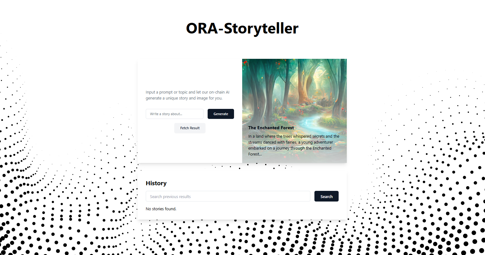

# ORA Storyteller

ORA Storyteller is an innovative web application designed to help users create and share interactive stories. Built with Next.js, TypeScript, and Tailwind CSS, ORA Storyteller leverages an onchain AI (ORA) to provide a unique storytelling experience.

live link - https://ora-storyteller.on-fleek.app/ 


## Features

- **Interactive Story Creation**: Input a prompt or topic and let the on-chain AI generate a unique story and image for you.
- **Blockchain Integration**: Utilizes Web3 and the ORA Plugin to interact with the Ethereum blockchain.
- **Optimized Images**: Uses Next.js's Image component for optimized image loading and performance.
- **Responsive Design**: Built with Tailwind CSS to ensure a responsive and visually appealing design across all devices.


## Getting Started

### Prerequisites

- Node.js
- npm 

### Installation

1. Clone the repository:
   ```sh
   git clone https://github.com/yourusername/ora-storyteller.git
   cd ora-storyteller

2. Install dependencies
    ```sh
    npm install

3. Running the Development Serve
    ```sh
    npm run dev

Open http://localhost:3000 with your browser to see the result.

### Deployment

Follow the deployment instructions for your hosting provider. Ensure the `.next` directory is included in the build output.

### Usage

1. **Input a Prompt**: Enter a topic or prompt in the input field.
2. **Generate Story**: Click the "Generate" button to let the AI create a unique story based on your prompt.
3. **Fetch Result**: After a short waiting period, click the "Fetch Result" button to retrieve the generated story and image.
4. **View History**: Browse through previously generated stories in the history section.

### Screenshot



### License

This project is licensed under the MIT License.
